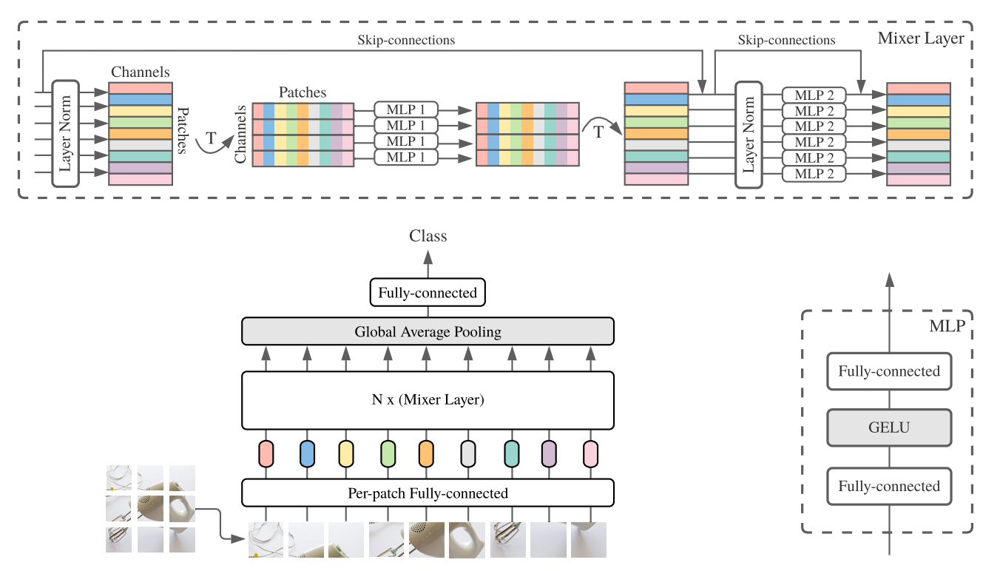

# mlp-mixer-pytorch
PyTorch implementation of ["MLP-Mixer: An all-MLP Architecture for Vision" Tolstikhin et al. (2021)](https://arxiv.org/abs/2105.01601)

</img>

## Usage

```python
import torch
from mlp_mixer import MLPMixer

model = MLPMixer(
    num_classes = 10,
    num_layers = 8,
    image_size = 256,
    patch_size = 32,
    channels = 3,
    hidden_dim = 512,
    tokens_hidden_dim = 256,
    channels_hidden_dim = 2048
)

x = torch.randn(1, 3, 256, 256)
model(x) # (1, 10)
```

# Preconfigured models
```python
from mlp_mixer.models import (
    mlp_mixer_s16,
    mlp_mixer_s32,
    mlp_mixer_b16,
    mlp_mixer_b32,
    mlp_mixer_l16,
    mlp_mixer_l32,
    mlp_mixer_h14
)

model = mlp_mixer_s16(
    num_classes = 10,
    image_size = 256,
    channels = 3
)

x = torch.randn(1, 3, 256, 256)
model(x) # (1, 10)
```

# Install

```bash
pip install -r requirements.txt
```

# Tests

```bash
pytest -ra
```
